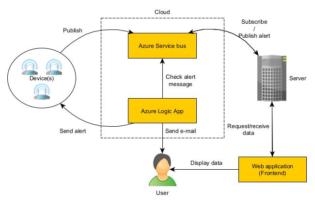

# DHT11 Sensor Monitoring System
A project that utilizes a DHT11 sensor to measure temperature and humidity and provides real-time monitoring and alerts. The project includes a web frontend built with Angular, a Node.js server, and integration with Azure services for data processing and notification.

## Description
The DHT11 Sensor Monitoring System allows you to monitor temperature and humidity readings from a DHT11 sensor in real-time. The system consists of three main components:

1. Frontend: A web application built with Angular that provides a user-friendly interface for viewing sensor data, selecting devices, and receiving alerts.

2. Server: A Node.js server that acts as an intermediary between the frontend and the sensor. It handles requests from the frontend, retrieves data from the sensor, and provides APIs for accessing device information and data.

3. Azure Integration: The system integrates with Azure services for data processing and notifications. It utilizes Azure Service Bus Topics for publishing sensor data, Azure Logic Apps for email notifications, and Azure Functions for data processing and triggering alerts.

The project enables you to visualize sensor data, track historical trends, set thresholds for alert notifications, and receive email alerts when the temperature or humidity exceeds the defined thresholds.

## Features
- Real-time monitoring of temperature and humidity readings
- Select and view data from multiple devices/sensors
- Historical data visualization through charts and graphs
- Threshold-based alert system for high temperature or humidity levels
- Email notifications for triggered alerts
- Integration with Azure services for scalable data processing and notifications

# Installation
1. Clone the repository from GitHub.
2. Install the necessary dependencies for the frontend and server using npm.
3. Set up the Azure services (Service Bus, Logic Apps, Functions) according to the provided instructions in the project documentation.
4. Configure the publisher (arduino) and server to connect to the appropriate Azure resources by updating the configuration files with the required connection strings and endpoints.

## Usage
Connect arduino with DHT11 sensor to the PC, start helper script

```
node .\publisher.js
```

Start the server ( `node .\backend\server.js`).
Launch the frontend in the `frontend` directory (`ng serve`).
Access the frontend in your web browser to see device/s and data.
Monitor the charts and receive email alerts when the thresholds are exceeded.

## Architecture - data flow



## Technologies and services
The project utilizes the following technologies and services:

- Angular: Frontend web application framework
- Node.js: Server-side and publisher(arduino) runtime environment
- Express.js: Web application framework for the server
- Azure Service Bus: Messaging service for publishing sensor data and triggering alerts
- Azure Logic Apps: Workflow automation and email notification system
- DHT11 Sensor library for arduino + Temperature and humidity sensor
